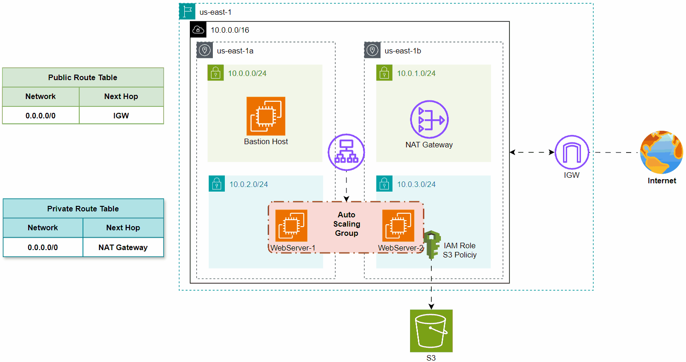

# (AWS) Autoscale Web Server

## Architecture Overview

<figure><figcaption></figcaption></figure>

This architecture deploys a VPC with public and private subnets across two availability zones in the **us-east-1** region. A Bastion Host in the public subnet provides secure SSH access, while a NAT Gateway enables internet access for private subnets. An Auto Scaling Group hosts web servers in private subnets, with IAM roles granting access to an S3 bucket for storage. The setup ensures high availability, scalability, and secure backend resources using Terraform and AWS services.

***

## Variables Resource Deployment

```hcl
variable "aws_region" {
  default = "us-east-1"
}

variable "env" {
  description = "Environment (e.g., dev, prod)"
  default     = "dev"
}

variable "cidrs" {
  description = "All CIDR's Block"
  type = list(object({
    cidr = string
    name = string
  }))
}
```

in this code, declare (aws\_region, env, and ciders) for reusable use

```hcl
cidrs = [
  {
    cidr = "10.0.0.0/16"
    name = "vpc"
  },
  {
    cidr = "10.0.0.0/24"
    name = "public-subnet-a"
  },
  {
    cidr = "10.0.1.0/24"
    name = "public-subnet-b"
  },
  {
    cidr = "10.0.2.0/24"
    name = "private-subnet-a"
  },
  {
    cidr = "10.0.3.0/24"
    name = "private-subnet-b"
  },
]
```

in this code, Initliaztion (ciders).

## Provider Resource Deployment

```hcl
terraform {
  required_providers {
    aws = {
      source  = "hashicorp/aws"
      version = "~> 5.0"
    }
  }
  cloud {

    organization = "terraform_project_01"

    workspaces {
      name = "dev"
    }
  }
}

provider "aws" {
  region = "us-east-1"
}
```

in this code, import state file to HashiCorp Cloud platform for security, and using AWS as cloud provider.

## VPC and Route Table Resource Deployment

<pre class="language-hcl"><code class="lang-hcl">resource "aws_vpc" "main_vpc" {
  cidr_block           = var.cidrs[0].cidr
  enable_dns_hostnames = true
  enable_dns_support   = true
  tags = {
    Name = "${var.env}-${var.cidrs[0].name}"
  }
}

<strong>resource "aws_route_table" "public_rtb" {
</strong>  vpc_id = aws_vpc.main_vpc.id
  route {
    cidr_block = "0.0.0.0/0"
    gateway_id = aws_internet_gateway.main_igw.id
  }
  tags = {
    Name = "${var.env}-public-rtb"
  }
}

resource "aws_route_table_association" "associate_public_a" {
  subnet_id      = aws_subnet.public_subnet_a.id
  route_table_id = aws_route_table.public_rtb.id
}

resource "aws_route_table_association" "associate_public_b" {
  subnet_id      = aws_subnet.public_subnet_b.id
  route_table_id = aws_route_table.public_rtb.id
}

resource "aws_route_table" "private_rtb" {
  vpc_id = aws_vpc.main_vpc.id
  route {
    cidr_block     = "0.0.0.0/0"
    nat_gateway_id = aws_nat_gateway.main_nat_gw.id
  }
}

resource "aws_route_table_association" "associate_private_a" {
  subnet_id      = aws_subnet.private_subnet_a.id
  route_table_id = aws_route_table.private_rtb.id
}

resource "aws_route_table_association" "associate_private_b" {
  subnet_id      = aws_subnet.private_subnet_b.id
  route_table_id = aws_route_table.private_rtb.id
}
</code></pre>

in this code, created VPC network with Two Route table,

## Subnet Resource Deployment


## Gateway Resource Deployment


## Security Group Resource Deployment


## Bastion Host Resource Deployment


## Load Balancer Resource Deployment


## Auto Scaling Resource Deployment


## IAM Resource Deployment


## S3 Bucket Resource Deployment


## Test Examples

<figure><figcaption></figcaption></figure>

<figure><figcaption></figcaption></figure>

<figure><figcaption></figcaption></figure>

<figure><figcaption></figcaption></figure>

<figure><figcaption></figcaption></figure>

<figure><figcaption></figcaption></figure>

<figure><figcaption></figcaption></figure>

<figure><figcaption></figcaption></figure>
