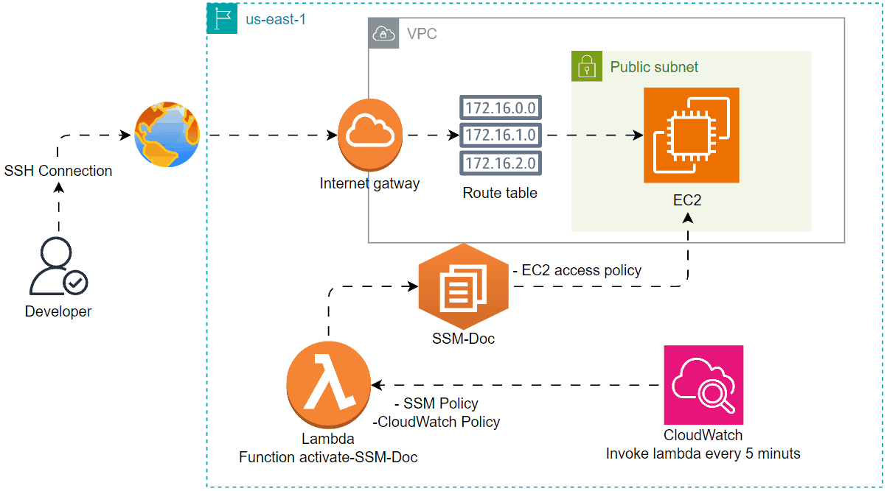

# Lambda - Invoke SSM document

<figure><figcaption><p>Task</p></figcaption></figure>

## Diagram

<figure><figcaption><p>Week Nine Diagram</p></figcaption></figure>

## File Structure

```
.
├── .terraform/
├── README.md
├── .gitignore
├── .terraform.lock.hcl
├── ec2.tf
├── iam.tf
├── lambda_function.py
├── lambda.tf
├── lambda.zip
├── provider.tf
├── security.tf
├── ssm.tf
├── ssmShellConfigs.json
├── subnet.tf
├── terraform.tfvars
├── variable.tf
└── vpc.tf

```

## Steps

### Configure The  Provider

* Create a new file called `provider.tf`
* configure the provider as below code

```terraform
terraform {
  required_providers {
    aws = {
      source  = "hashicorp/aws"
      version = "~> 5.0"
    }
  }

  cloud {
    organization = "DevOps-Kitchen"
    workspaces {
      name = "DevOps-workshop"
    }
  }
}

provider "aws" {
  region = var.AWS_DEFAULT_REGION
}
```

***

### VPC Resources Deployment

* Create a file called `vpc.tf`
* configure the provider as below code

Created VPC with Route table that point to Internet Gateway so my subnet be Public

```terraform
resource "aws_vpc" "forgtech-vpc" {
  cidr_block           = var.cidr[0].cidr-block
  enable_dns_support   = "true"
  enable_dns_hostnames = "true"
  tags                 = var.environment
}


resource "aws_internet_gateway" "forgtec-igw" {
  vpc_id = aws_vpc.forgtech-vpc.id

  tags = var.environment
}

resource "aws_route_table" "forgtech-public-rtb" {
  vpc_id = aws_vpc.forgtech-vpc.id

  route {
    cidr_block = "0.0.0.0/0"
    gateway_id = aws_internet_gateway.forgtec-igw.id
  }

  tags = var.environment
}
resource "aws_route_table_association" "associate_sub_with_pub_rtb" {
  subnet_id      = aws_subnet.forgtech-public-subnet-a[0].id
  route_table_id = aws_route_table.forgtech-public-rtb.id
}
```

**Dynamic Public Subnet Creation**\
We use the `count` attribute to dynamically create multiple public subnets within a VPC. Each subnet is assigned a CIDR block using the `cidrsubnet` function, which ensures the subnet ranges are derived from the VPC's CIDR.

**Key Attributes Explained**:

* **`count`**: Defines the number of public subnets to create. It is either the number of availability zones (AZs) or the value specified in `var.preferred_number_of_public_subnets`.
* **`cidr_block`**: Uses the `cidrsubnet` function with:
  1. `var.cidr[0].cidr-block` as the base CIDR (the VPC CIDR).
  2. `4` as the new prefix (determines the size of the subnets).
  3. `count.index` to ensure each subnet gets a unique range.
* **`availability_zone`**: Assigns an AZ to each subnet based on its index.
* **`map_public_ip_on_launch`**: Ensures that instances in the subnet automatically receive a public IP.

```
# Create public subnet AZ a
resource "aws_subnet" "forgtech-public-subnet-a" {
  vpc_id                  = aws_vpc.forgtech-vpc.id
  count                   = var.preferred_number_of_public_subnets == null ? length(data.aws_availability_zones.available.names) : var.preferred_number_of_public_subnets
  cidr_block              = cidrsubnet(var.cidr[0].cidr-block, 4, count.index)
  map_public_ip_on_launch = true # making sure any ec2 put in this subnet will have IP address
  availability_zone       = data.aws_availability_zones.available.names[count.index]
}
```

### EC2 Resource Deployment

* Create a file called `ec2.tf`

We use iam\_instance\_profile to attach ec2-role to our ec2, and  we user\_data to make ec2 install amazon ssm

```terraform
resource "aws_instance" "forgtech-ec2" {
  ami                         = "ami-0a3c3a20c09d6f377"
  instance_type               = "t2.micro"
  subnet_id                   = aws_subnet.forgtech-public-subnet-a[0].id
  vpc_security_group_ids      = [aws_security_group.forgtech-ec2-sg.id]
  key_name                    = "forgtech-keypair" # Attach key pair here
  associate_public_ip_address = true
  iam_instance_profile        = aws_iam_instance_profile.ec2-profile.name
  tags                        = var.environment
  user_data                   = <<-EOF
              #!/bin/bash
              sudo yum install -y https://s3.amazonaws.com/ec2-downloads-windows/SSMAgent/latest/linux_amd64/amazon-ssm-agent.rpm
              sudo systemctl start amazon-ssm-agent
    EOF
}

resource "aws_iam_instance_profile" "ec2-profile" {
  name = "ec2-profile"
  role = aws_iam_role.ec2-role.name
}

```

### Security Group Deployment

In this task we only need to connect to ec2 with SSH protocol so we will configure security group with that

* Create a file called security.tf
* configure as below code

```terraform
resource "aws_security_group" "forgtech-ec2-sg" {
  name        = "ec2-sg"
  description = "ec2 rules"
  vpc_id      = aws_vpc.forgtech-vpc.id
  tags        = var.environment
}

resource "aws_vpc_security_group_ingress_rule" "forgtech-ec2-ingress" {
  security_group_id = aws_security_group.forgtech-ec2-sg.id
  from_port         = 22
  to_port           = 22
  ip_protocol       = "tcp"
  cidr_ipv4         = "0.0.0.0/0"
}
resource "aws_vpc_security_group_egress_rule" "forgtech-ec2-egress" {
  security_group_id = aws_security_group.forgtech-ec2-sg.id
  ip_protocol       = "-1"
  cidr_ipv4         = "0.0.0.0/0"
}

```

### IAM Resource Deployment

We have created Lambda Role and EC2 Role

* Lambda-Role with full access to EC2 and SSM
* EC2 Role with SSMInstacneCore full access

```terraform
# ============================== @Lambda Role@ ==============================
data "aws_iam_policy_document" "lambda-assume-role" {
  statement {
    actions = [
      "sts:AssumeRole"
    ]
    principals {
      type        = "Service"
      identifiers = ["lambda.amazonaws.com"]

    }
    effect = "Allow"
  }
}

resource "aws_iam_role" "lambda-role" {
  name = "lambda-role"

  assume_role_policy = data.aws_iam_policy_document.lambda-assume-role.json
  tags               = var.environment
}

resource "aws_iam_role_policy_attachment" "lambda-ssm-policy-attachment" {
  policy_arn = "arn:aws:iam::aws:policy/AmazonSSMFullAccess"
  role       = aws_iam_role.lambda-role.name
}

resource "aws_iam_role_policy_attachment" "lambda-ec2-policy-attachment" {
  policy_arn = "arn:aws:iam::aws:policy/AmazonEC2FullAccess"
  role       = aws_iam_role.lambda-role.name
}
# ============================== @Lambda Role End@ ==========================


# ============================== @EC2 Role@ ==============================

data "aws_iam_policy_document" "ec2-assume-role" {
  statement {
    actions = [
      "sts:AssumeRole"
    ]
    principals {
      type        = "Service"
      identifiers = ["ec2.amazonaws.com", "ssm.amazonaws.com"]

    }
    effect = "Allow"
  }
}
resource "aws_iam_role" "ec2-role" {
  name = "ec2-role"

  assume_role_policy = data.aws_iam_policy_document.ec2-assume-role.json
  tags               = var.environment
}

resource "aws_iam_role_policy_attachment" "ssm-policy-attachment" {
  policy_arn = "arn:aws:iam::aws:policy/AmazonSSMManagedInstanceCore"
  role       = aws_iam_role.ec2-role.name
}

# ============================== @EC2 Role End@ ==========================

```

### SSM Resource Deployment

#### **What is SSM (AWS Systems Manager)?**

SSM (AWS Systems Manager) is a service provided by AWS to simplify and centralize the management of EC2 instances and other AWS resources.

**Key Components**:

1. **SSM Document (SSM Document)**:
   * A configuration file that contains a list of commands or steps to execute.
   * Examples include installing software, running scripts, or updating configurations.
   * These documents can be predefined by AWS or custom-created to fit specific needs.
2. **SSM Agent**:
   * A service pre-installed on most EC2 instances by AWS.
   * The agent runs on each EC2 instance and listens for commands from SSM.
   * Allows you to remotely execute commands or automation tasks on your EC2 instances.

* Create a file called ssm.tf
* configure as below code

```terraform
# Create an SSM holds Shell configs
resource "aws_ssm_document" "ssm_document_shell_configs" {
  name          = "ssm_document_shell_configs"
  document_type = "Command"
  content       = file("${path.module}/ssmShellConfigs.json")
}
```

* Create a file called ssmShellConfigs.json
* configure as below cod

```json
{
    "schemaVersion": "2.2",
    "description": "Use this document to deploy and configure Linux Servers ",
    "mainSteps": [
      {
        "action": "aws:runShellScript",
        "name": "runShellScript",
        "precondition": {
          "StringEquals": [
            "platformType",
            "Linux"
          ]
        },
        "inputs": {
          "runCommand": [
            "#!/bin/bash",
            "mkdir /testDir",
            "touch /testDir/testFile"
          ]
        }
      }
    ]
  }
```

### Lambda function code Preparation

We need to create a function that activate SSM Document to Specific EC2 Instance

* Create a file called lambda\_function.py
* configure as below code

```python
import boto3
import os

def lambda_handler(event, context):

    # Retrieve the SSM document name from environment variable (optional)
    # ssm_document_name = os.environ['SSM_DOCUMENT_NAME']

    # Hardcode the document name for simplicity
    ssm_document_name = "ssm_document_shell_configs"
    ec2_instance_id = os.environ['EC2_INSTANCE_ID']  # hold the instance ID from environment variable

    # Create an SSM client
    ssm_client = boto3.client('ssm', region_name='us-east-1')

    # Define command parameters
    document_name = ssm_document_name
    document_version = "1"
    targets = [{"Key": "InstanceIds", "Values": [ec2_instance_id]}]
    parameters = {}  # No parameters specified in the command
    timeout_seconds = 120
    max_concurrency = "5"
    max_errors = "1"


    try:
        # Send the SSM document execution command
        response = ssm_client.send_command(
            DocumentName=document_name,
            DocumentVersion=document_version,
            Targets=targets,
            Parameters=parameters,
            TimeoutSeconds=timeout_seconds,
            MaxConcurrency=max_concurrency,
            MaxErrors=max_errors
        )

        # Print a success message
        print(f"Command sent successfully. Command ID: {response['Command']['CommandId']}")

    except Exception as error:
        print(f"Error occurred: {error}")
```

### Lambda Resource Deployment

we need to configure lambda to run python code, But first we need to <mark style="color:red;">ZIP</mark> our Code so we need to use&#x20;

<mark style="color:red;">`zip -r lambda.zip lambda_function.py`</mark> Then

* Create a file called lambda.tf
* configure as a below code

in handler attribute we use `<filename>.<functionname>`

```terraform
resource "aws_lambda_function" "lambda-activate-ssm-doc" {
  filename      = "lambda.zip"
  function_name = "ssm-activate-function"
  role          = aws_iam_role.lambda-role.arn
  handler       = "lambda_function.lambda_handler"
  runtime       = "python3.12"

  environment { # its Environment vars in the code
    variables = {
      EC2_INSTANCE_ID = aws_instance.forgtech-ec2.id # EC2 ID
    }
  }
  tags = var.environment
}
```

**You can check whole Task in here (** [**Github** ](https://github.com/omartamer630/DevOps-Kitchen/tree/main/09-%20Week%20Nine)**)**

## Working Examples

<figure><figcaption><p>VPC, Subnet, Route Table, And internetgateway</p></figcaption></figure>

<figure><figcaption><p>EC2 Works</p></figcaption></figure>

<figure><figcaption><p>SSM Document Works</p></figcaption></figure>

<figure><figcaption><p>Lambda Function Works</p></figcaption></figure>

<figure><figcaption><p>SSM Activated By lambda</p></figcaption></figure>

<figure><figcaption><p>EC2 Checks Folder Creation by SSM Document</p></figcaption></figure>

## Conclusion

This project creates an **SSM document**, a **Lambda function** to trigger the document, and an **EC2 instance** to run the commands. IAM roles are set up to allow Lambda and EC2 to communicate with AWS Systems Manager (SSM).
