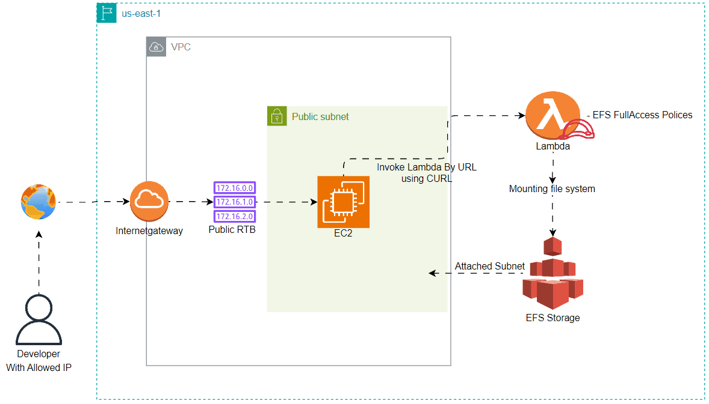

# Lambda - URL Invoking

<figure><figcaption><p>Task</p></figcaption></figure>

## Diagram

<figure><figcaption><p>Diagram Ten GIF</p></figcaption></figure>

## File Structure

```
.
├── .terraform/
├── .gitignore
├── .terraform.lock.hcl
├── ec2.tf
├── efs.tf
├── iam.tf
├── lambda_function.py
├── lambda.tf
├── lambda.zip
├── provider.tf
├── README.md
├── security.tf
├── subnet.tf
├── task10.pdf
├── terraform.tfvars
├── variable.tf
└── vpc.tf

```

## Steps

### Configure the provider

* Create a new file called `provider.tf`
* configure the provider as below code

```terraform
terraform {
  required_providers {
    aws = {
      source  = "hashicorp/aws"
      version = "~> 5.0"
    }
  }

  cloud {
    organization = "DevOps-Kitchen"
    workspaces {
      name = "DevOps-workshop"
    }
  }
}

provider "aws" {
  region = var.AWS_DEFAULT_REGION
}
```

### VPC Resource Deployment

We need to Create VPC Network with Public subnet for  Developer accessing EC2 by SSH Connection,

So we need  VPC, Subnet, Route Table, and finally Internet gateway

1. Create a file called vpc.tf and put VPC, Route table, and internet gateway

```terraform
resource "aws_vpc" "forgtech-vpc" {
  cidr_block           = var.cidr[0].cidr-block
  enable_dns_support   = "true" # to resolve hostname IP 
  enable_dns_hostnames = "true" # to assign hostname for every resource in vpc
  tags                 = var.environment
}

resource "aws_internet_gateway" "forgtec-igw" {
  vpc_id = aws_vpc.forgtech-vpc.id

  tags = var.environment
}

resource "aws_route_table" "forgtech-public-rtb" {
  vpc_id = aws_vpc.forgtech-vpc.id

  route {
    cidr_block = "0.0.0.0/0"
    gateway_id = aws_internet_gateway.forgtec-igw.id
  }

  tags = var.environment
}
resource "aws_route_table_association" "associate_sub_with_pub_rtb" {
  subnet_id      = aws_subnet.forgtech-public-subnet-a[0].id
  route_table_id = aws_route_table.forgtech-public-rtb.id
}
```

2. Create a file called subnet.tf

* Described this behavior in [#vpc-resources-deployment](lambda-invoke-ssm-document.md#vpc-resources-deployment "mention")

```terraform
# Create public subnet AZ a
resource "aws_subnet" "forgtech-public-subnet-a" {
  vpc_id                  = aws_vpc.forgtech-vpc.id
  count                   = var.preferred_number_of_public_subnets == null ? length(data.aws_availability_zones.available.names) : var.preferred_number_of_public_subnets
  cidr_block              = cidrsubnet(var.cidr[0].cidr-block, 4, count.index)
  map_public_ip_on_launch = true # making sure any ec2 put in this subnet will have IP address
  availability_zone       = data.aws_availability_zones.available.names[count.index]
}

```

### Security Group Resource Deployment

before we create EC2 Resource we need to configure who can access we should go with the least privilege access but for testing purpose we will use `0.0.0.0/0` All IPs can access <mark style="color:red;">not recommended at all.</mark>

1. EC2 SSH Rules

```terraform
resource "aws_security_group" "forgtech-ec2-sg" {
  name        = "ec2-sg"
  description = "ec2 rules"
  vpc_id      = aws_vpc.forgtech-vpc.id
  tags        = var.environment
}

resource "aws_vpc_security_group_ingress_rule" "forgtech-ec2-ingress" {
  security_group_id = aws_security_group.forgtech-ec2-sg.id
  from_port         = 22
  to_port           = 22
  ip_protocol       = "tcp"
  cidr_ipv4         = "0.0.0.0/0"
}
resource "aws_vpc_security_group_egress_rule" "forgtech-ec2-egress" {
  security_group_id = aws_security_group.forgtech-ec2-sg.id
  ip_protocol       = "-1"
  cidr_ipv4         = "0.0.0.0/0"
}

```

2. EFS Rules&#x20;

```terraform
# Inbound rule for EFS allowing traffic from EC2 instances
resource "aws_security_group_ingress" "efs-ingress" {
  security_group_id        = aws_security_group.forgtech-ec2-sg.id
  from_port                = 2049
  to_port                  = 2049
  ip_protocol              = "tcp"
  source_security_group_id = aws_security_group.forgtech-ec2-sg.id
}

resource "aws_security_group_egress" "efs-egress" {
  security_group_id = aws_security_group.forgtech-ec2-sg.id
  ip_protocol       = "-1"
  cidr_blocks       = ["0.0.0.0/0"]
}
```

### EC2 Resource Deployment

We need to create EC2  that will Invoke Lambda By curl Lambda URL

we will use user\_data to make sure curl is installed in our EC2

```terraform
resource "aws_instance" "forgtech-ec2" {
  ami                         = "ami-0866a3c8686eaeeba" # Ubuntu AMI
  instance_type               = "t2.micro"
  subnet_id                   = aws_subnet.forgtech-public-subnet[0].id
  vpc_security_group_ids      = [aws_security_group.forgtech-ec2-sg.id]
  key_name                    = "forgtech-keypair" # Attach key pair here
  associate_public_ip_address = true
  iam_instance_profile        = aws_iam_instance_profile.ec2-profile.name
  tags                        = var.environment
  user_data                   = <<-EOF
              #!/bin/bash
              sudo apt install update -y && sudo apt install curl -y
    EOF
}
```

### IAM Resource Deployment

We need to Create IAM Role for EC2 to Invoke Lambda using Curl, and we also need IAM Role for Lambda to access EFS Storage, so I will give Lambda EFSFullAccess policy to EFS,

1. Create IAM Role For EC2

```terraform
data "aws_iam_policy_document" "ec2-assume-role" {
  statement {
    actions = [
      "sts:AssumeRole"
    ]
    principals {
      type        = "Service"
      identifiers = ["ec2.amazonaws.com", "lambda.amazonaws.com"]

    }
    effect = "Allow"
  }
}
resource "aws_iam_role" "ec2-role" {
  name = "ec2-role"

  assume_role_policy = data.aws_iam_policy_document.ec2-assume-role.json
  tags               = var.environment
}

data "aws_iam_policy_document" "ec2-lambda-function-url-policy" {
  statement {
    actions = [
      "lambda:InvokeFunctionUrl"
    ]
    resources = [
      "*"
    ]
    effect = "Allow"
  }
}

resource "aws_iam_policy" "json-ec2-lambda-policy" {
  name = "ec2-lambda-policy"
  description = "ec2-lambda-policy"
  policy = data.aws_iam_policy_document.ec2-lambda-function-url-policy.json
  tags = var.environment
}
resource "aws_iam_role_policy_attachment" "ssm-policy-attachment" {
  policy_arn = aws_iam_policy.json-ec2-lambda-policy.arn
  role       = aws_iam_role.ec2-role.name
}

resource "aws_iam_instance_profile" "ec2-profile" {
  name = "ec2-profile"
  role = aws_iam_role.ec2-role.name
}
```

2. Create IAM Role For Lambda

```terraform
data "aws_iam_policy_document" "lambda-assume-role" {
  statement {
    actions = [
      "sts:AssumeRole"
    ]
    principals {
      type        = "Service"
      identifiers = ["lambda.amazonaws.com"]

    }
    effect = "Allow"
  }
}

resource "aws_iam_role" "lambda-role" {
  name = "lambda-role"

  assume_role_policy = data.aws_iam_policy_document.lambda-assume-role.json
  tags               = var.environment
}

resource "aws_iam_role_policy_attachment" "lambda-ec2-policy-attachment" {
  policy_arn = "arn:aws:iam::aws:policy/AmazonElasticFileSystemFullAccess"
  role       = aws_iam_role.lambda-role.name
}
```

### EFS Resource Deployment

#### _What is Elastic File System?_

_EFS is AWS Fully managed service, EFS is a file storage service that's scalable and high availability ( multi AZ option), you can share EFS with multiple EC2 instances can simultaneously access the same file system, making it perfect for applications that require shared storage._

So we need to create EFS that point to EC2 Subnet&#x20;

```terraform
resource "aws_efs_file_system" "forgtech_efs_storage_ec2" {
  tags = var.environment
}

# Mount target connects the file system to the subnet
resource "aws_efs_mount_target" "efs-ec2-target" {
  file_system_id  = aws_efs_file_system.forgtech_efs_storage_ec2.id
  subnet_id       = aws_subnet.forgtech-public-subnet[0].id
  security_groups = [aws_security_group.forgtech-ec2-sg.id]
}

# EFS access point used by lambda file system
resource "aws_efs_access_point" "access_point_for_lambda" {
  file_system_id = aws_efs_file_system.forgtech_efs_storage_ec2.id

  root_directory {
    path = "/lambda"
    creation_info {
      owner_gid   = 1000
      owner_uid   = 1000
      permissions = "750" # limit access to only lambda
    }
  }

  posix_user {
    gid = 1000
    uid = 1000
  }
}
```

### Lambda Resource Deployment

We need to create lambda that take ZIP Code who activate EFS mount storage in ec2, and create function URL so we can invoke lambda via CURL, Note: Lambda Depend on EFS Resource to be created first, and configure file system with mount path.


```terraform
resource "aws_lambda_function" "lambda-efs-mount" {
  filename      = "lambda.zip"
  function_name = "efs-mount-function"
  role          = aws_iam_role.lambda-role.arn
  handler       = "lambda_function.lambda_handler"
  runtime       = "python3.12"
  tags          = var.environment

  file_system_config {
    arn              = aws_efs_access_point.access_point_for_lambda.arn
    local_mount_path = "/mnt/efs"
  }
  vpc_config {
    # Every subnet should be able to reach an EFS mount target in the same Availability Zone. Cross-AZ mounts are not permitted.
    subnet_ids         = [aws_subnet.forgtech-public-subnet[0].id]
    security_group_ids = [aws_security_group.forgtech-ec2-sg.id]
  }

  depends_on = [aws_efs_mount_target.efs-ec2-target]

}

resource "aws_lambda_function_url" "lamba-efs-url" {
  function_name      = aws_lambda_function.lambda-efs-mount.function_name
  authorization_type = "NONE"
}
```

**You can check whole Task in here (** [**Github** ](https://github.com/omartamer630/DevOps-Kitchen/tree/main/09-%20Week%20Nine)**)**

## Working Examples

<figure><figcaption><p>EC2 Policy Created</p></figcaption></figure>

<figure><figcaption><p>IAM Role Created</p></figcaption></figure>

<figure><figcaption><p>Network Created</p></figcaption></figure>

<figure><figcaption><p>EFS Created</p></figcaption></figure>

<figure><figcaption><p>EC2 Created</p></figcaption></figure>

<figure><figcaption><p>Lambda With Function URL Created</p></figcaption></figure>

<figure><figcaption><p>Invoke Lambda using URL Worked</p></figcaption></figure>

<figure><figcaption><p>EFS Mount Worked</p></figcaption></figure>

## Conclusion

In this task, I successfully learned how to:

1. **Create an EFS (Elastic File System) Environment**:
   * I set up an EFS file system for use across multiple EC2 instances, ensuring they can access shared storage.
   * Configured security groups, VPC, and EFS mount targets to ensure proper communication between EC2 instances and the EFS system.
   * Used NFS for mounting the EFS file system on EC2 instances and ensured correct IAM roles and permissions for EC2 to interact with the EFS.
2. **Invoke Lambda Functions Using Function URL**:
   * I set up an AWS Lambda function and invoked it via a Lambda Function URL, enabling communication with external systems or applications.
   * Integrated Lambda with EFS to allow the function to access shared storage, and configured necessary access points and IAM roles for security.

Through this task, I gained hands-on experience in configuring AWS EFS and Lambda, as well as securing resources with IAM roles and security groups. I also became more familiar with AWS networking concepts, including VPCs, subnets, and security group configuration

