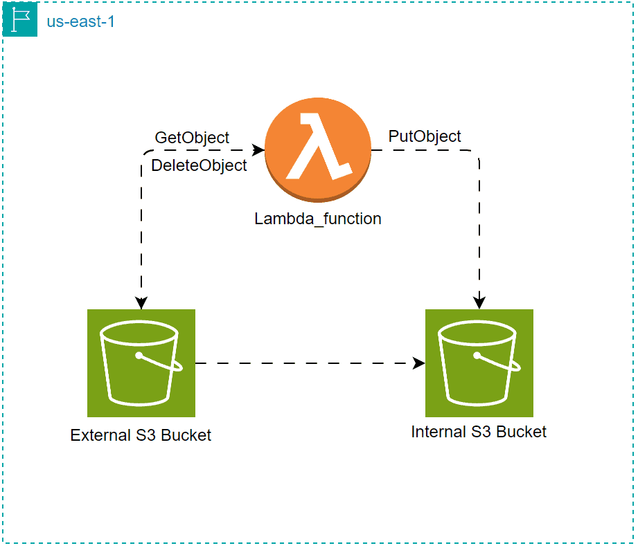

# Manage file Transfer between S3 Buckets using Lambda

<figure><figcaption></figcaption></figure>

## Diagram

<figure><figcaption><p>Week Eight Diagram</p></figcaption></figure>

## AWS Lambda Basics Explanation

* Function Event: is the data who triggers the lambda function.
* Function context: it's properties and methods allow your function to access vital information about its execution environment, which can be crucial for tasks such as logging, error handling, and resource management examples (function\_name, invoked\_function\_arn,aws\_request\_id, and etc...).
* Function environment variables: use it for configuration settings, and reusable function
* Layers: Allow you to package libraries and other dependencies to reduce the size of deployment archives and makes it faster to deploy your code.
* Differences between Sync and A Sync:

**Synchronous Invocation:**

* The caller waits for the function to process the results.
* The function's response is returned directly to the caller.
* Suitable for real-time applications <mark style="color:red;">**where immediate feedback is required.**</mark>

**Asynchronous Invocation:**

* The caller sends an event to Lambda and gets a quick success response, <mark style="color:red;">**while Lambda processes the event in the background**</mark>.
* Lambda queues the event for processing and returns a `202 ACCEPTED` status code.
* Ideal for background tasks or operations <mark style="color:red;">**where immediate results are not critical**</mark><mark style="color:red;">.</mark>


## File Structure

```
.
├── .terraform/
├── README.md
├── .gitignore
├── .terraform.lock.hcl
├── iam.tf
├── lambda_function.py
├── lambda.tf
├── lambda.zip
├── provider.tf
├── s3.tf
├── terraform.tfvars
└── variable.tf
```

## Steps

```terraform
# Create External Bucket 
resource "aws_s3_bucket" "forgtech-external-bucket" {
  bucket = "frogtech-us-external"
  force_destroy = true
  
  tags = {
    Enviroment = var.environment[0]
    Owner = var.environment[1]
  }
}

# Create Internal Bucket 
resource "aws_s3_bucket" "forgtech-internal-bucket" {
  bucket = "frogtech-us-internal"
  force_destroy = true
  tags = {
    Enviroment = var.environment[0]
    Owner = var.environment[1]
  }
}
```

1. Created Two S3 Bucket ( Internal and External )

```terraform
# allow lambda to use this IAM Role
data "aws_iam_policy_document" "lambda-assume-policy" {
  statement {
    actions = [
      "sts:AssumeRole"
    ]
    principals {
      type = "Service"
      identifiers = ["lambda.amazonaws.com"]
      
    }
    effect = "Allow"
  }
}

resource "aws_iam_role" "lambda-s3-transfer-file-role" {
  name = "lambda-role"

  assume_role_policy = data.aws_iam_policy_document.lambda-assume-policy.json
  tags = {
    Enviroment: var.environment[0]
    Owner: var.environment[1]
  }
}

# Make Inline Policy to allow lambda that can Get and Upload Object Through S3 bucket
data "aws_iam_policy_document" "lambda-policy-to-access-s3" {
  statement {
    actions = [
      "s3:GetObject",
      "s3:PutObject",
      "s3:DeleteObject"
    ]
    resources = [ 
      "${aws_s3_bucket.forgtech-external-bucket.arn}/*", 
      "${aws_s3_bucket.forgtech-internal-bucket.arn}/*"
      ]
    effect = "Allow"
  }
}

# Convert json to arn so i can attach policy to lambda role
resource "aws_iam_policy" "json-arn-lambda-policy" {
  name = "lambda-policy"
  description = "lambda s3 policy"
  policy = data.aws_iam_policy_document.lambda-policy-to-access-s3.json
  tags = {
    Enviroment: var.environment[0]
    Owner: var.environment[1]
  }
}

# attach policy to lambda IAM role
resource "aws_iam_role_policy_attachment" "lambda-role-policy" {
  role = aws_iam_role.lambda-s3-transfer-file-role.name
  policy_arn = aws_iam_policy.json-arn-lambda-policy.arn
}
```

2. Created Assume Policy to allow Lambda use IAM Role that I created, Then  created Inline policy that make anyone with this permissions could get, delete, and upload object in S3, Then created resource <mark style="color:red;">aws\_iam\_policy</mark> to convert policy to JSON and attach it to the role in aws\_iam\_role\_policy\_attachment

```terraform
# Create Lambda function with the code to transfer file from external to internal s3
resource "aws_lambda_function" "forgtech-file-transfer-function" {

  filename      = "lambda.zip"
  function_name = "s3-file-transfer-function"
  role          = aws_iam_role.lambda-s3-transfer-file-role.arn
  handler       = "lambda_function.lambda_handler"
  runtime = "python3.9"

  environment {  # its Environment vars in the code
    variables = {
      SOURCE_BUCKET = aws_s3_bucket.forgtech-external-bucket.bucket # src that get object from external s3
      DEST_BUCKET = aws_s3_bucket.forgtech-internal-bucket.bucket #  dest that upload object to internal s3
    }
  }
}
# allow lambda s3 bucket event to incoke my lambda function from s3 external bucket
resource "aws_lambda_permission" "allow-s3" {
  statement_id  = "AllowS3Invoke"
  action        = "lambda:InvokeFunction"
  function_name = aws_lambda_function.forgtech-file-transfer-function.function_name
  principal     = "events.amazonaws.com"
  source_arn    = "${aws_s3_bucket.forgtech-external-bucket.arn}"
}

# set trigger or event when object is created it trigger lambda function 
resource "aws_s3_bucket_notification" "external_bucket_notification" {
  bucket = aws_s3_bucket.forgtech-external-bucket.bucket

  lambda_function {
    events = ["s3:ObjectCreated:*"]
    lambda_function_arn = aws_lambda_function.forgtech-file-transfer-function.arn
  }

  depends_on = [aws_lambda_permission.allow-s3]
}
```

3. Created aws\_lambda\_function and named it <mark style="color:red;">s3-file-transfer-function</mark> and put it the of the code <mark style="color:red;">lambda.zip</mark>, I used environment object for flexible and reusable code in lambda\_function.py file, Then created <mark style="color:red;">aws\_lambda\_permission to allow s3 external bucket</mark> to trigger lambda, And finally created <mark style="color:red;">aws\_s3\_bucket\_notification to create event</mark> when object is uploaded in external s3 bucket then trigger lambda function.

**You can check whole Task in here (** [**Github** ](https://github.com/omartamer630/DevOps-Kitchen/tree/main/08-%20Week%20Eight)**)**

## Working Examples

<figure><figcaption><p>HCP Interface</p></figcaption></figure>

<figure><figcaption><p>Created S3 Bucket</p></figcaption></figure>

<figure><figcaption><p>Created Lambda</p></figcaption></figure>

<figure><figcaption><p>Finally, file transfer Successfully</p></figcaption></figure>

## Conclusion

I learned how to connect Lambda with S3 buckets. I used an IAM role and policy to allow Lambda to interact with the S3 buckets. Then, I created a Lambda function with the code to transfer files from one bucket to another. Finally, I set permissions and triggers to invoke the Lambda function when a new object is uploaded to the external S3 bucket.

